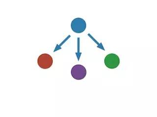
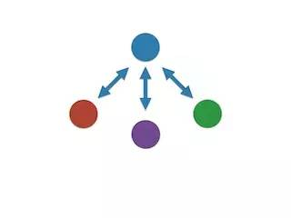
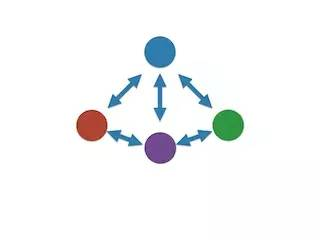
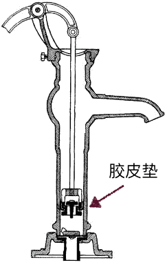

# 众创书籍
 
 《新生 —— 七年就是一辈子》，是一本“众创书籍”。我只是开头的那个人，这本“书”的作者是所有付费读者。本质上来看，我在改变网络结构。
 
 过去，作者与读者之间的关系是这样的，它的信息流向是单一的：
 
 
 
 一个作者写，许多读者看，完了，没了。互联网的出现，在过去的许多年里，一定的程度上，已经把结构变成这样了：
 
 
 
 
 我在写《把时间当作朋友》的时候，因为是把内容直接发表在自己的博客上，写的过程中就有很多读者前来留言，评论…… 也就是说，读者可以直接提供反馈了 —— 这远比想象中意义重大得多。
 
 现在，在《新生 —— 七年就是一辈子》里，我要把结构改成这样：
 
 
 
 在这个新的结构里，每一个读者，也是作者，因为这是一本“众创书籍”，他们的记录，他们产生的内容，才是真正有价值的内容、可积累、可发酵的内容……并且，他们之间也可以相互沟通…… 这是一个去中心化思考的应用，文件传输早就 P2P 化了，连货币都 P2P 化了，书籍为什么不能？知识传播为什么不能？
 
 我只是第一个成员而已。
 
 小时候，我们在村里打水，刚开始是从井里弄，再后来就有了手动抽水泵…… 打水的时候，要带一点水过去。先用水瓢把带过去的那一点水浇进去；那水会把胶皮垫的四周封住，即，胶皮垫与水泵的铁制泵桶之间缝隙被水填满，进而通过上下抽动泵杆，形成抽水的气压，多抽动几下，地下的水就被源源不断地“抽”出来了……
 
 
 
 我现在天天写的文章，就好像是我小时候去打水的时候带过去的那一点点水，每写一篇，就好像是抽动一下泵杆，反复多次，就会形成抽水气压，进而就有大量的水被“抽”出来……
 
 从某个角度望过去，《把时间当作朋友》，其实只不过是一句话：
 
 > **一切都靠积累。**
 
 《新生 —— 七年就是一辈子》，其实也只不过是一句话：
 
 我们必须主动升级自己的操作系统。
 
 写书这东西，有时候就是这么无聊：
 
 > **把一句话写成一本书。**
 
 当然了，若是一定要如此总结的话，那么人类史上的绝大多数小说，其实都是一个字：
 
 > **争。**
 
 《新生 —— 七年就是一辈子》的主旨再展开一点，是这样的：
 
 > - **我们必须主动升级自己的操作系统。**
 > - **我们的操作系统由概念和方法论构成。**
 
 于是，读者在这里看到的文章，其实都是一个套路：说清楚一个概念，或者说清楚一个方法论，分享它们在我脑子里的现在的样子，过去的样子，一路是怎样转变（升级）过来的…… 这些文章，基本上都相当于“范文”，涵盖的就是一下进一步的主旨拓展：
 
 > - 我们必须主动升级自己的操作系统。
 > - 我们的操作系统主要由概念和方法论构成。
 > - 我们要把自己进化为多任务、多模式的操作系统。
 > - 不断进化的操作系统要与、也只能与其他不断进化的操作系统沟通。
 > - 沟通的目的是分享，分享最终会形成惊喜……
 
 未来付费社群里的成员也会被要求写同样结构的文章。反正大家在成长，反正大家在进步，反正大家时时刻刻都在升级自己的操作系统，总是有这个或者那个概念被升级，被替换，被修正。把它记录下来，成为这部“共创书籍”的一部分。
 