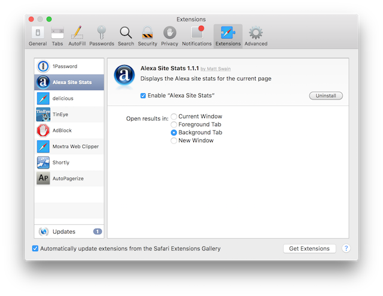

# 选书的基本原则
 
 书是要精读的，必须精，没的商量。所以才更需要认真选书。而书必须自己选。选书也是一种必须习得并培养的能力。**别找人要书单，那只不过是给别人制造负担——谁会知道别人应该看什么书？！**即便是老师，也只能说个大概。最终，自己要看的书，需要自己找。以下十几个简单的原则，基本上能帮助任何一个正常人做出自己的决定。
 
### 1 出版社
 每个出版社的出版能力各不相同，也各有所长。尽量选择在锁定的领域里知名的出版社。反正你不能买电影出版社出版的《精通 Python》——这当然是玩笑，电影出版社没出过这么一本书。
 
### 2 作者
 靠谱的人写出来的东西靠谱。在决定是否花时间精力去读之前，可以花一点时间去了解作者。注意，要去了解作者在该领域中的能力，至于作者的其他方面，必须暂时放在一边。
 
### 3 版次
 第一版的书，慎买慎读。再版次数越多，说明此书的内容越经典。优先选择那些“第 n 版”（n 越大越好）的书。
 
### 4 印次
 有时，要学习的领域太新，乃至于只有第一版的书。那就要看，有没有那种印次已经很多的书：比如，第一版第 n 次印刷（n 越大越好）。
 
### 5 印数
 即便最终你不得不买第一版第一次印刷的书，那也最好先看看印数。首印数量太少，可能说明出版社对其销量没有信心……
 
### 6 “编”与“著”
 编著这两个字经常放在一起，但实际上有天壤之别。“著”的意思是原创成分更多，“编”的意思是"拿来放在一起"……有的书缺德，把两个字放在一起用“编著”糊弄读者。当然要优选“著作”。
 
### 7 参考文献(References)
 为了习得知识而去读书，多是技术文献之类的“非虚构类书籍”(Non-Fiction)。如果书后没有详尽的“参考文献”列表，那这本书不值得读——更多的可能性是，那并非是作者用笔写的，而是他用剪刀浆糊拼出来的东西。这一条格外重要，真的在乎它，就会知道中文书中，可选择数量其实很少。另外，好书的“参考文献”往往相当于一个地图，你按图索骥，就会找到更多好书、经典书。
 
### 8 索引(Index)
 好的参考文献，或者说，合格的参考文献，是要有详尽的索引的。印刷版的书，没有索引，就没办法检索——那书的用处何止减半！当然，这也是我们为什么更喜欢电子书的重要原因：可随时全文搜索！
 
### 9 尽量不读译作
 这是很有“偏向性”的固执看法（stubborn opinion）。尽管译者永远出于好心，但好心未必带来好结果——这又是事实。既然你决定继续读下去，还是先接受这个建议吧。
 
 更为重要的是，学门外语（尤其是英语），根本没那么难，甚至很容易，能不能学，能不能学会，只不过是学习意识问题。
 
 以上几个原则，尽管简单，但是如若你将他们拼起来应用，就会发现，市面上书确实不少，值得看、值得读的真的不多。于是你就释然了，于是你就淡定了，于是你就不害怕精读了……
 
### 10 花点时间去读书评
 [Amazon](http://amazon.com)、[Douban](http://douban.com)上的书评都很棒，尽管也需要一点点的甄别能力（遗憾的是，豆瓣上“书托”越来越多了——读中文有很多“意外的负担”）。
 
### 11 看看牛人在读什么
 网络时代有很多方法可以去了解牛人们在做什么，牛人的共同特征是喜欢分享。他们正在看的东西，是他们筛选过后的，常常有很大参考价值。注意，是“**参考**价值”，不一定是“价值”。(这里有个很好的例子：[Some Books for Software-oriented Humans](http://www.patmaddox.com/2012/03/28/some-books-for-software-oriented-humans/)，文章作者是 Pat Maddox, Rspec 核心开发团队 2 号人物。)
 
#### 网络内容质量判断
 
 跟选书一样，网站的内容也常常要筛选。而且，由于在网上发布内容没有类似“出版社”之类的机构“事先编审”，所以，好内容实际上可能比例更低。所以，还是要有一套方法去筛选内容。首先要尽量了解作者，比如，英文的作者，就看看他的 [Twitter](https://twitter.com)或 [Facebook](http://www.facebook.com)，如果是中文作者，就看看他的微博。另外，另外，尽管并不总是准确，但排名高的网站比例上来看更可靠一些。尽管很多人对[Alexa](http://www.alexa.com)的排名不屑，但在这些年里它一直是帮我筛选网站的一个重要参考依据。无论是用 Safari，还是 Google Chrome 或者  Firefox，我都会安装 Alexa 插件，以便随时了解一个网站的排名。
 
 
 